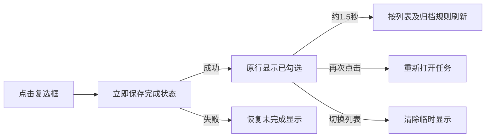

# 任务完成反馈

任务勾选后需要让用户看清完成的是哪一项，避免下一行立即补位造成误点。

完成反馈是列表控制器的临时显示状态，不属于领域数据，也不改变归档策略。通过行复选框完成任务时，复选框先同步绘制已勾选状态，再执行保存及变更通知，避免磁盘写入和侧栏刷新推迟勾号显示；状态立即保存，已勾选行在原位置保留约 1.5 秒，再按当前列表规则刷新。标题使用现有的完成态颜色；停留期间再次点击可重新打开任务。

`list/completion-feedback.swift` 管理按任务 ID 区分的延迟回调，支持连续完成多项。`TaskListController.reload` 保留临时任务行并调整标题索引；项目历史暂不重复展示这些行，空列表提示在反馈结束后出现。切换路由或销毁控制器时取消回调，不阻塞导航。键盘和批量操作沿用原有行为。

停留结束使用约 0.18 秒的原生淡出与行收起动画，让下方任务平滑补位，只刷新界面，不再写入数据。系统开启“减少动态效果”时直接更新。关闭应用时完成状态已经持久化；保存失败不会制造虚假的完成状态。若用户选择延后归档，反馈结束后任务仍按原归档策略显示。

项目完成入口采用相同的约 1.5 秒停留时间：立即保存项目及任务，圆环显示勾号，保留侧栏项目和已完成任务后再刷新。取消项目不显示完成勾号。重新打开或撤销会取消项目待隐藏回调，历史任务状态仍保留。
