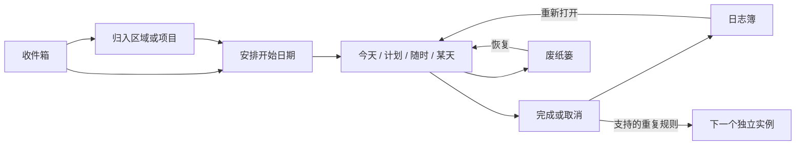

# 领域与架构

## 背景与术语

拾事围绕“收集想法、安排行动、完成后归档”组织个人工作。区域是长期职责，项目是有明确目标的事项集合，标题分组是项目内部的组织单元，任务是可完成的行动，清单是任务内的步骤。

任务的开始日期、截止日期、完成状态、删除状态互相独立。开始日期决定何时开始显示；截止日期决定何时到期。用户曾在 Things 隐藏的到期提示通过 `deadlineSuppressionDate` 保留，不因导入而重新挤入今天。

## 不变量

1. 每个实体 ID 唯一，任务的区域、项目、标题、清单引用合法。
2. 空白新任务是草稿，保存前不污染数据库；有内容的无标题草稿拒绝离开并保留输入。
3. 每次修改先生成完整候选快照、验证并原子写入，磁盘成功后才替换内存状态和发通知。
4. 原始文件损坏时进入保护状态，不能以空库覆盖。恢复备份先校验并保存旧文件。
5. 同库仅允许一个本机写入进程。撤销与重做使用已验证的快照，文本编辑优先使用文本自己的撤销管理器。
6. 删除任务保留状态和内容；删除项目保留项目及关联内容，永久删除需用户确认。
7. 完成重复任务消费当前实例的重复规则并生成后继；重新打开旧实例不会重复创建同一后继。固定周期以原开始日期为锚点并跳过所有已过去的周期，后继始终落在今天之后；“完成后”重复以完成时刻为锚点推进一个周期。
8. 导入重复模板、未支持规则、空标题与提醒信息不会静默丢弃；来源数据保留在可选 `SourceInfo` 中。

## 模块边界

| 目录 / 文件 | 职责 | 依赖 |
|---|---|---|
| `Sources/ShishiCore` | 模型、筛选、重复规则、导入转换、JSON 存储 | Foundation、系统 SQLite |
| `Sources/CSQLite` | 系统 SQLite 的 Swift 模块描述 | 系统 sqlite3 |
| `Sources/Shishi/store.swift` | 主线程事务编排、撤销栈、通知 | ShishiCore |
| `Sources/Shishi/list` | 原生任务/项目行、行内编辑、分组和拖拽 | AppKit、Store |
| `Sources/Shishi/editor` | 完整任务、项目、区域编辑草稿 | AppKit、Store |
| `Sources/Shishi/sidebar` | 列表导航、区域折叠、区域/项目行内改名、项目入口 | AppKit、Store |
| `Sources/Shishi/settings` | 外观、备份、Things 导入预览 | AppKit、Store |
| `app.swift` / `window.swift` | 生命周期、窗口与菜单编排 | AppKit、各 UI 模块 |
| `library-lock.swift` | 进程级排他锁 | Darwin |
| `scripts` / `resources` | 本机构建打包、自绘应用图标、帮助 | macOS 工具链 |

新项目以功能目录隔离多代理写入。核心规则没有 AppKit 依赖；页面不直接修改 SQLite 或原始 Things 数据。

## 保存与故障恢复

`编辑草稿 → 收集当前 field editor / 输入法内容 → 验证 → 原子写入 → 更新内存 → 刷新列表`。失败返回中文反馈，保留输入和上一个成功状态。新库及导入数据都沿同一验证路径。

数据库 schema 当前为 1，增补的来源、标签、项目状态与日期字段采用可选解码，兼容初版已保存文件；未知未来版本拒绝读取以防误写。修改模型字段需补旧 JSON 兼容、引用验证、导入和恢复用例。
