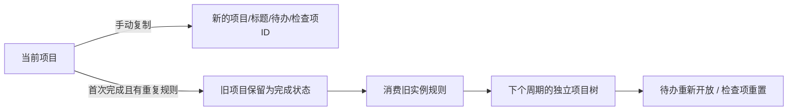
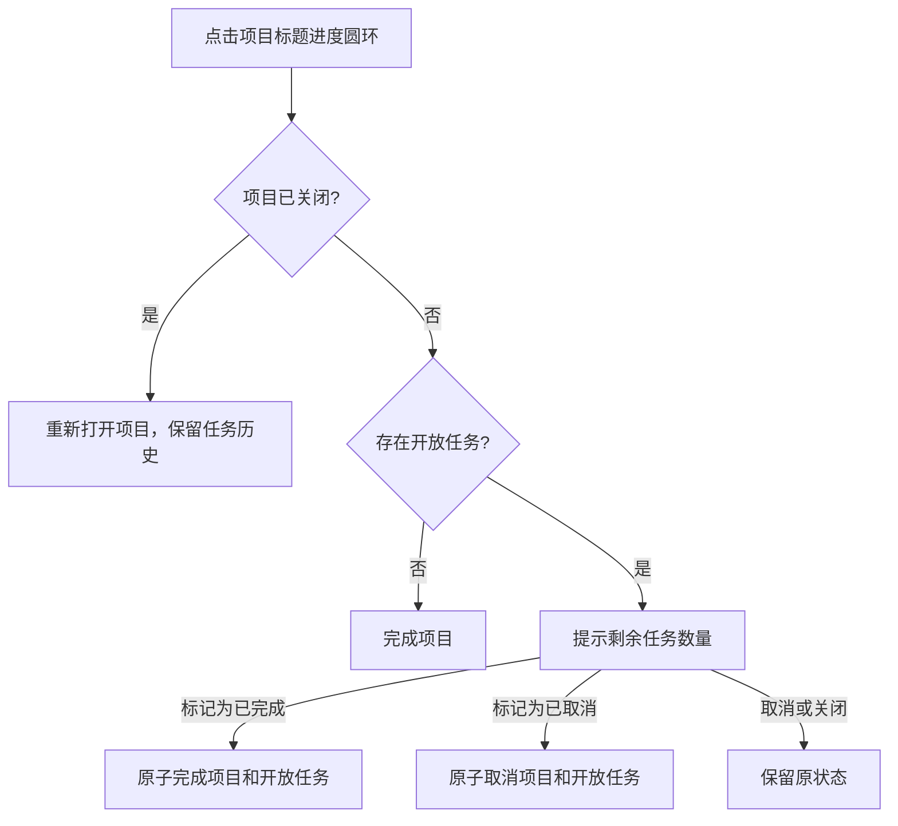

# 项目页：进度、录入项和操作菜单

## 进度与录入项

项目标题前的蓝色圆形图标按该项目的真实待办计算，检查列表步骤不重复计数；删除的待办、删除标题下的待办以及内部重复模板不计入。开放项目的进度为已完成数 /（开放数 + 已完成数），取消的任务不进入分母。完成项目本身时显示完成状态。

侧栏项目图标、项目标题及智能列表复用同一进度组件和状态配置，只有尺寸不同。侧栏只列出开放且未删除的项目，不再追加“已完成项目”分组；完成或取消的项目仍保留在日志簿，可打开、重新开始或撤销，不删除历史数据。从日志簿打开不在侧栏中的项目时，侧栏清除旧选择高亮，避免左右指向不同项目。

默认仅显示开放待办。项目内容底部的“显示 N 个录入项”展开该项目已完成及已取消的任务，按记录时间倒序；点击“隐藏 N 个录入项”收起。完成、重新打开、删除或撤销会同步刷新数量和进度，不修改原历史数据来配合展示。

## 空格新建

底部默认五个图标等宽排列，悬停显示圆角轮廓。“新建标题”悬停提示说明“将您的项目分为不同类别或阶段”，项目内⇧⌘N同样打开新建标题分组；其他列表⇧⌘N沿用新建项目。新建项目也始终可从文件菜单访问。

项目浏览时按空格可直接新建待办并聚焦标题，继承当前选中的标题分组。标题、备注、检查项、搜索等文本编辑中不截获空格；带修饰键、长按重复事件、模态窗口和已关闭项目不触发新建。新建仅打开草稿，保存前不写入空任务。

## 原地编辑

- 备注：标题下方直接点击输入，空内容显示“备注”占位（占位不入库）。停顿约 0.6 秒自动保存，失焦、切换页面、关窗或退出时立即保存。已完成或已删除的项目只读。
- 项目标题与标题分组：双击进入编辑，停顿即保存；Return 或点别处提交，Escape 撤回本次所有改动，空标题保持原名。编辑标题分组期间列表暂停重建，避免输入框被刷新掉。
- 选中或编辑中的标题分组、待办行、检查项统一使用 #D7E5FF 浅蓝圆角底（无描边），列表分隔线为 20% 透明度的浅线，标题分组选中或编辑时隐藏“＋”、自己的分隔线，以及紧贴在上方的上一行分隔线。

## 长备注

项目标题、完整备注与下方待办在同一个文档中整体滚动，底部工具栏保持固定。备注不再限制为160pt或使用独立滚动条；长内容不会撑高窗口，滚动至备注末尾即可继续查看待办。全文保持可选择；窗口首次尚无有效宽度时延后排版，内容/宽度不变时复用测量结果，避免反复对长文全文排版。此规则按用户最新Things截图修正，取代1.0.3的局部备注滚动方案。

## 标题旁的更多菜单

侧栏选择与内容刷新分开处理：点击项目只同步选中行并切换右侧内容，保留已有侧栏控件；数据或偏好变化时才重建侧栏并更新任务计数、项目进度。侧栏不存在的历史项目会清除选择，不保留其他项目的高亮。

| 操作 | 行为 |
|---|---|
| 完成项目 / 重新打开项目 | 修改项目状态，原待办历史保留 |
| 时间 | 今天、今晚、明天、随时、某天或指定日期 |
| 添加标签 | 编辑项目标签，提交前保留草稿 |
| 添加截止日期 | 独立设置或清除截止日期 |
| 移动 | 移到某个区域或移出区域，同步子任务的项目归属区域 |
| 重复… | 对开放项目配置天/周/月/年、间隔、完成后重复或不重复 |
| 复制项目 | 新建独立项目树，ID全部重建，原数据不变 |
| 删除项目 | 确认后移到废纸篓，可恢复；默认按钮为取消 |
| 分享… | 打开原生分享选择器，由用户选择服务并执行发送 |

分享草稿排除废纸篓及内部模板，不自动发送数据。底部默认工具栏提供新建待办、新建标题、时间、移动、搜索；选中待办/检查项时仍使用对应的上下文操作栏。

## 复制与重复

手动副本保留任务状态、日期、备注、标签和清单勾选，清空来源标识及重复关联；排除删除内容和内部重复模板。重复后继会重新开放任务并重置清单，平移显式日期；没有单独日期的非“某天”待办随下个周期安排，防止提前出现。

复制、项目完成生成后继、撤销/重做均为单次持久化事务。非法规则、引用或磁盘错误不会产生半份项目。重新打开再完成已消费规则的旧项目，不会重复生成同一后继。

本功能不自动启用导入的旧 Things 复杂项目重复模板；其原始信息仍保留，用户可在开放项目上明确设置新规则。

侧栏选中行始终保持品牌蓝底和强调文字，右侧标题、备注或检查项获得编辑焦点时不变灰。区域展开/收缩只插入或移除该区域的项目行，保留其它控件；项目计数和进度在数据刷新时缓存，折叠操作不重新扫描任务。折叠隐藏当前项目时保留右侧路由并清除不可见选择，重新展开后恢复选择；行号变化不触发导航回调。

## 点击项目进度完成或取消

项目页标题左侧的圆环是完成入口，侧栏和智能列表中的进度图标继续用于展示。入口支持鼠标、键盘和辅助功能。项目没有开放任务时直接标记完成；有开放任务时显示剩余数量及三个纵向按钮：

- **标记为已完成**：项目及剩余开放任务标记完成。
- **标记为已取消**：项目及剩余开放任务标记取消。
- **取消**：关闭提示框，不修改数据；Escape 或点击弹窗外侧同样取消。

`ProjectActionsController` 为标题圆环和项目菜单共用确认入口，确认期间固定项目 ID，提交时读取最新快照。`ProjectOperations.finish` 在候选快照内处理开放任务，排除已删除任务、已删除标题下任务及内部重复模板，保留既有完成/取消历史和检查项。调用既有项目保存逻辑，完成重复项目生成一个开放后继，取消项目不生成后继。`TaskStore.finishProject` 一次写入并记录一次撤销，写入失败保持整个项目树不变；归档时机沿用设置，数据格式不变。已完成或取消项目再次点击圆环只重新打开项目，不恢复历史任务。

项目完成后，标题及侧栏圆环立即显示内部勾号，侧栏项目和列表中的已完成任务在原位置停留约 1.5 秒后按归档设置刷新。此停留由 `project-feedback.swift` 管理，仅为临时 UI 状态，不写入数据；完成状态立即持久化。停留期间重新打开、撤销或删除项目会取消待执行的隐藏回调，写入失败清除临时反馈。仅子任务全部完成但项目未关闭时仍显示进度圆盘，不显示勾号；取消项目不显示完成勾号。

确认弹窗的任意按钮点击后立即关闭，不播放退出动画。选择完成时，先将标题圆环切换为勾号并提交绘制，再在下一次主线程调度执行保存和观察者刷新，使同步写盘不阻塞按钮事件收尾。等待保存期间同一项目的重复提交被忽略；写盘失败恢复真实图标状态。任务和项目的 1.5 秒停留仍从保存成功后开始，不延后到停留结束才保存。
