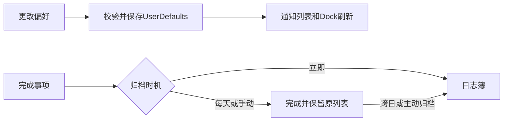

# 设置与系统集成

## 背景与范围

采用与本机Things设置相近的原生工具栏分类：常规、云同步、快速输入、提醒事项、日历，并额外保留拾事的数据与备份页。设置通过⌘,或侧栏底部打开；修改自动保存，无需“应用”。

## 常规规则

- 外观：自动/浅色/深色；兼容旧外观偏好。
- 文字大小：11–20pt，默认14pt。调整任务、检查项和列表阅读字号；设置窗口本身、辅助徽标固定系统字号。正在编辑时不重建卡片，结束编辑后刷新。
- 今天分组：按项目/区域分组，可关闭；不修改原任务顺序字段。
- Dock计数：无、到期、到期与今天、再加收件箱；并集按ID去重，排除已完成、取消和删除内容。
- 完成项归档：立即、每天、手动。完成事实与“是否仍保留在原列表”分开；新字段`pendingArchiveDate`为nil的旧历史仍保持已归档，不会重新出现。每天在本地日期跨日后归档，手动通过设置按钮或“项→归档已完成项”。可撤销，写盘失败保留原内容。

## 快速输入

全局快捷键由Carbon登记，不监听其他按键、不需要辅助功能权限。可关闭或切换预设组合，登记失败显示冲突状态；文件菜单和试用入口仍可使用。独立面板可添加到收件箱、今天或当前列表；已失效或不能添加的目标回退收件箱并说明。空标题/保存失败不清空；取消保留会话草稿；仅成功保存后清空。自动填写其他应用内容未接入，不自动读取剪贴板或选中文字。

## 日历与提醒事项

EventKit仅在用户点击授权时请求权限。默认不读取日历或提醒，测试使用可注入provider，无隐式授权。拒绝、撤销和读取失败需明确反馈。

- 日历：开启后只读显示所选日历；今天显示当日，计划显示含今天的7个本地日。跨日/全天事件按本地日期边界处理；不写入系统日历，不伪装成待办。
- 提醒事项：选择列表→预览未完成记录→勾选→导入。按`AppleReminders`来源ID幂等，复用现有合并备份与原子事务；保留本地编辑，失败可重试。
- **与Things不同**：导入仅复制，绝不自动删除或完成系统中的原提醒。附件、子任务结构和位置提醒不作等价迁移承诺，目前导入标题、备注与截止日期。

## 明确未接入

Things Cloud不能作为独立拾事应用的账户服务复用；当前无实时云同步。Spotlight、URL Scheme、快捷指令批量操作、自动填写和自动更新服务未实现，不显示伪开关。侧栏调整保持窗口宽度沿用现有行为。备份/恢复属于本地数据迁移，不等同云同步。

## 验证边界

自动化覆盖偏好校验/持久化、归档/撤销、Dock去重、快速录入失败与取消、系统集成权限拒绝/撤销/幂等。真实系统授权需用户主动操作；fake provider不能证明真实账户连接或真实日历数据读取成功。未经过完整VoiceOver研究，不声称达到全部Things功能等价。
