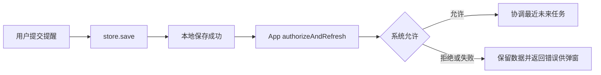

# 任务提醒

`Todo.reminderDate: Date?` 是本地用户显式设置的绝对提醒时刻。旧 JSON 缺失字段解码为 nil，Things metadata 不会启用提醒。有限但已过期的日期可以保存，通知协调仅选择未来日期。手动项目副本清空提醒；重复任务与重复项目后继按周期锚点平移提醒，保留相对时间，原实例仍保留历史日期。

App 在主线程持有 `TaskNotifications(store: store)`。正常启动调用 `start()`，安装 delegate、监听 `TaskStore.changed` 并协调队列，不申请权限，不启用旧来源 metadata 提醒。已有权限时恢复明确保存的 reminderDate；关闭、删除或备份恢复遗留的请求会清理。QA 不调用 start 或授权；单元测试注入 `TaskNotificationProvider`，完全不访问真实通知中心。

日期弹窗先更新 `Todo.reminderDate` 并调用 `store.save`。只有保存成功、用户主动提交变化后的非 nil 提醒时，App 才调用 `await notifications.authorizeAndRefresh()`。返回 String 时显示该错误：本地提醒已保存，但系统授权或队列协调失败；不要回滚本地数据或显示通知成功。容量不足时返回仅保存在本地的任务标题。返回 nil 表示本轮所有有效提醒协调成功，但并不保证系统一定展示。取消提醒及撤销依靠 store.changed 刷新，不请求权限。

`refresh()` 仅启动队列协调，永远不申请权限；`waitForRefresh()` 可等待已启动协调完成。`authorizationStatus`、`lastError` 和 `scheduledIdentifiers` 可读取，状态更新发布 `TaskNotifications.changed`。外部系统设置改变后，App 可调用 refresh 重新读取权限。

仅 open、未删除且未处于关闭项目中的真实任务可以调度；继承项目/标题分组删除状态，排除 Things 内部重复模板。稳定 ID 为 `shishi.task.reminder.<小写 UUID>`。日期或标题更新撤销旧请求并替换，关闭、删除、取消及撤销按最新快照协调。最多调度最近 64 个任务，其他功能已有请求占用容量时相应减少，不删除其他功能通知。绝对日期按 UTC 日历秒精度提交，前台通过 UserNotifications delegate 展示 banner/list/sound。

协调以 generation 标记并串行执行，异步读取过期即放弃；不可取消的陈旧 add 返回后删除该请求，再按最新快照补回，因此同 ID 更新不会被旧异步完成覆盖。权限拒绝清空本功能待发队列，保留数据库日期；add 失败不计为成功，后续 refresh 可以重试。
