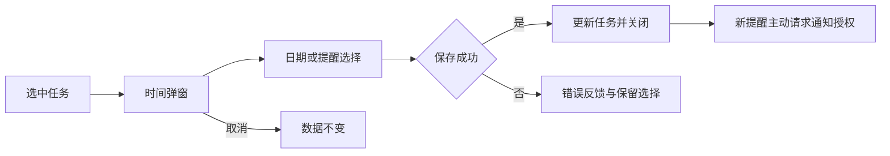

# 任务时间与提醒

底部日期按钮仅在选中开放待办时启用。项目、标题分组、检查项和空选择不提供任务安排；编辑卡片时使用卡片自己的日期入口。

点击任务操作栏的时间按钮，在上方弹出紧凑面板。时间输入支持明确日期和快捷表达；今天、今晚、周历日期、某天选择仅作用于当前任务。选择成功保存后关闭，点击外部或Escape取消不变更。切换任务会关闭旧弹窗；提交时核对任务没有被其他操作修改，失败保留面板供重试。

安排开始日期与截止日期相互独立。今晚仍为当天安排并带晚间标记，某天保留想法但清除开始日期。提醒时间作为独立可选字段保存；只有用户主动设置新提醒时请求系统通知授权。没有系统授权时本地时间仍保留，反馈需要授权才能发送。

通知按任务ID更新，完成、取消或删除任务时清理；未来提醒按时间选择最多64项调度。旧Things数据库中的来源提醒元数据不会因此自动激活。系统实际投递受用户通知权限与系统通知设置控制。所有自动测试使用fake通知服务，不申请权限或发送真实通知。
